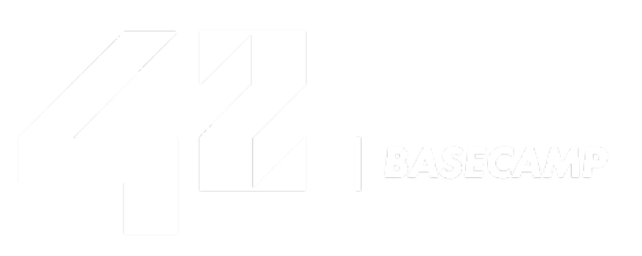
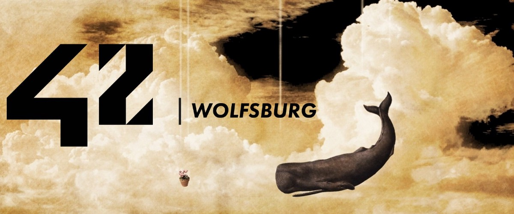

# 42WOLFSBURG

## BOOTCAMP

### FEBRUARY 2121

## Author

👤 **Igors Oleinikovs**

- GitHub: [Igors78](https://github.com/Igors78)
- Twitter: [@oleinikovs](https://twitter.com/oleinikovs)
- LinkedIn:
  [Oleinikovs Igors](https://www.linkedin.com/in/igors-oleinikovs-17a10958/)

## 🤝 Contributing

Contributions, issues, and feature requests are welcome!

## Show your support

Give a ⭐️ if you like this project!

## Acknowledgments

- 42 Wolfsburg
- Udemy C course

## 📝 License

This project is [UNLicense](./LICENSE) licensed.
